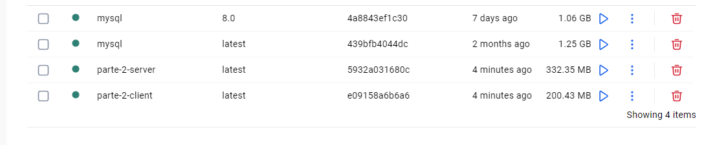
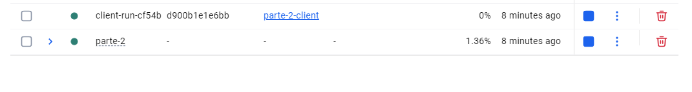

# PFO 2 - DevOps


## 📦 Parte 1 - Fundamentos de Docker: Nginx y MySQL

Esta sección cubre los pasos y comandos utilizados para completar la Parte 1 de la práctica, centrada en la creación y enlace manual de contenedores, y su posterior orquestación con Docker Compose.

### ⚙️ Ejecución del Stack de la Parte 1

Todo el código y la configuración de esta parte se encuentran en el directorio `/parte-1`.

1.  **Navegar al directorio:**
    ```bash
    cd parte-1
    ```

2.  **Construir y levantar los contenedores:**
    ```bash
    docker-compose up --build
    ```

3.  **Verificación:**
    -   Acceder a `http://localhost:5001` en el navegador.
    -   Se debería mostrar un mensaje de éxito recuperado de la base de datos MySQL.

### 📝 Comandos Manuales Utilizados (Puntos 1-6 de la consigna)

-   **Lanzar contenedor MySQL:**
    ```bash
    docker run --name mysql-p1 -p 33066:3306 -e MYSQL_ROOT_PASSWORD=mi-clave-secreta -e MYSQL_DATABASE=db_parte1 -d mysql:8.0
    ```
-   **Conexión con MySQL Workbench:** Se utilizó el puerto `33066` para conectarse y crear la tabla `registros`.

### 💡 Problemas y Soluciones

-   **Problema:** Al lanzar el stack con `docker-compose`, la aplicación web no encontraba la tabla `registros`.
-   **Solución:** Se identificó que la tabla había sido creada en un contenedor manual que fue eliminado. La solución fue exponer el puerto de la base de datos del stack de Compose (`33067`) para poder conectarse con Workbench e inicializar la tabla en el volumen de datos persistente correcto.

---

# PARTE 2 - Proyecto Flask + MySQL + Cliente en Docker

Este proyecto implementa una API en Flask conectada a una base de datos MySQL, junto con un cliente Python interactivo que permite registrar usuarios, iniciar sesión y acceder a una página de tareas.

Todo está contenerizado con Docker y Docker Compose.

---

## 🖥️ Servicios

### 🔹 Servidor Flask (`server/app.py`)

- Expuesto en `http://localhost:5000`
- Endpoints:
  - `POST /registro` → Registra usuario en la BD
  - `POST /login` → Verifica credenciales
  - `GET /tareas` → Devuelve página HTML

### 🔹 Base de datos MySQL

- Imagen oficial: `mysql:8.0`
- Credenciales configuradas en `docker-compose.yml`:
  - Usuario: `user`
  - Password: `password`
  - Base de datos: `usuariosdb`

### 🔹 Cliente Python (`client/client.py`)

Aplicación de consola que permite:

1. Registrar usuario
2. Iniciar sesión
3. Ver tareas

---

## ⚙️ Ejecución

### Construir y levantar los contenedores

- docker-compose up --build

### Ejecutar el cliente por consola

- docker-compose run client

### Puertos utilizados

- Servidor Flask → localhost:5000

- Base de datos MySQL → localhost:3306

### Problemas y soluciones

- Problema: Al iniciar el servidor Flask, la base de datos no estaba lista aún.
- Solución: Se usó depends_on en docker-compose.yml para garantizar que db se levante antes que server.

### Imagenes:




